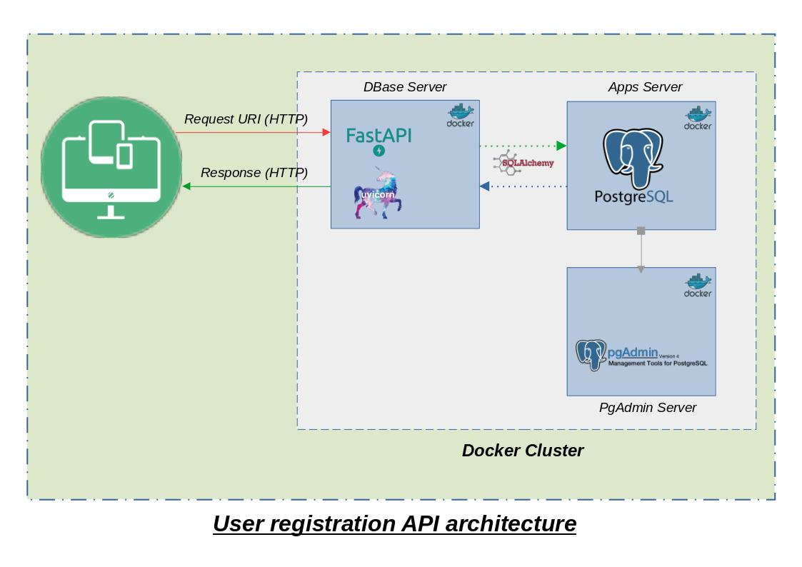
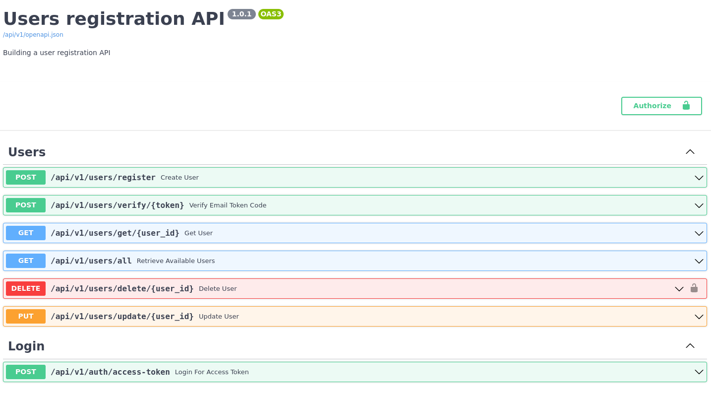
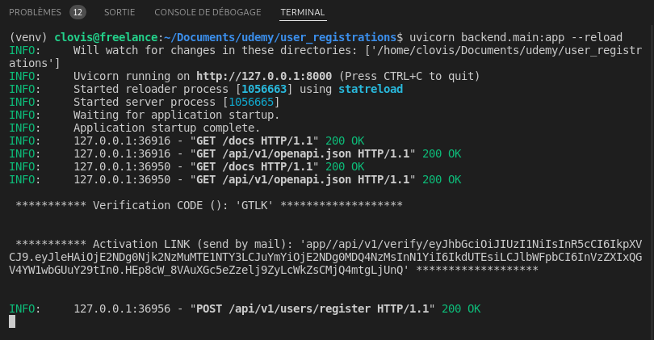
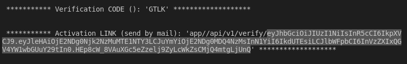
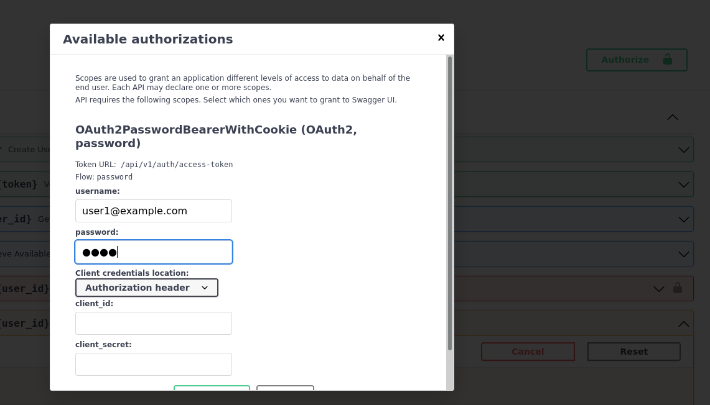
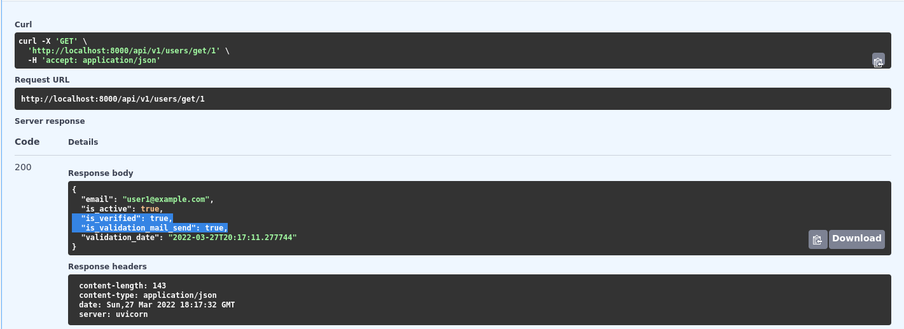

# User registration API using FastAPI and PostgreSQL

## Context

Dailymotion handles user registrations. To do so, user creates an account and we send a code by email to verify the account.

As a core API developer, you are responsible for building this feature and expose it through API.

## Specifications
You have to manage a user registration and his activation.

The API must support the following use cases:
* Create a user with an email and a password.
* Send an email to the user with a 4 digits code
* Activate this account with the 4 digits code received. For this step, we consider a `BASIC AUTH` is enough to check if he is the right user.
* The user has only one minute to use this code. After that, an error should be raised.

Design and build this API. You are completely free to propose the architecture you want.

## Implementation tools

For this first version, I used :
- Python [FastAPI](https://github.com/tiangolo/fastapi) framework, a *"modern, fast (high-performance), web framework for building APIs with Python 3.6+ based on standard Python type hints"*
- [PostgreSQL](https://www.postgresql.org/) for data base managment
- [SqSQLAlchemyl](https://www.sqlalchemy.org/) as Object Relational Mapper 
- [Alembic](https://alembic.sqlalchemy.org/en/latest/) for database migration
- [Docker](https://www.docker.com/) for virtualization
- [PgAdmin](https://www.pgadmin.org/) to To facilitate database administration from a docker container

## Architecture
[](https://github.com/kossovo/user_registration)

# How to run and test this API

## Requirements

* [Docker](https://www.docker.com/).
* [Docker Compose](https://docs.docker.com/compose/install/).

## Useful commands and tips
* Build and start the stack with Docker Compose:

```bash
docker-compose build
docker-compose up
```
**Note**: The first time you start your stack, it might take a minute for it to be ready. While the backend waits for the database to be ready and configures everything. You can check the logs to monitor it.


* API documentations
```bash
http://localhost:8000/docs
```
* PG Admin server (*connexion credentials in .env file*)
```bash
http://localhost:8050
```
* Launch unit tests
```bash
docker-compose run app pytest .
```

### Launch load testing
To improve this user registration API, I have setup a load testing script base on [locust](https://locust.io/). To run this this, you have to firtly run the app server, then run `locust` script using the following command:

```
locust -f backend/tests/load_testing/locust_test.py
```
And then, navigate to [http://localhost:8089](http://localhost:8089)

The locust try to create a user by the `register` entrypoint

## User registration API testing
[](https://github.com/kossovo/user_registration)

### Registration
When a user is created, an automatic email containing the `Activation Code` an a link is send. 
Here is the detailed process of creating a user:
- Checking given datas and create the user to the database
- Generate a `JWT` with a short long live (1 minutes - can be change to the [settings](https://github.com/kossovo/user_registration/blob/main/backend/core/configs.py#L30) file)
- Build a validation link ends by the generated token (as this token has a short long live, we can used it as an url parameter)
- Send a mail with the `activation link` and `verification code` to the new user

**[DEBUG]**

After a user registration, the `activation code` (also call `verification code`) and a part of a link are print on the prompt. The purpose is to simplified the API testing and debugging by your IT team.

[](https://github.com/kossovo/user_registration)

### Validate an account / email verification
To verify thier email, the new user has to click on the link received by email and enter the `verification code` to the redirection screen. 

To test this feature using entrypoint, you have to **copy** the token and the vérification code print on the prompt after regitration and used it as entrypoint imput data.

[](https://github.com/kossovo/user_registration)

### Login
You can log in using `access-token` entrypoint or simply click on `Authorize` button, which will open a wizard like the follow. 

Even if an user **isn't `verified`**, it can log in.

After the login operation, a `JWT` is generate and save in the user's cookies (more safety than `HTTP Header`). The default expire time is 30 minutes, but you can change this in the [settings parameters](https://github.com/kossovo/user_registration/blob/main/backend/core/configs.py#L28)
**Note**: The username field is for email

[](https://github.com/kossovo/user_registration)

### Validate email by enter received code
After verification, you can use the `get` entrypoint to ensure that the user's data has been updated.

This is how the the verification script works:

* Check that the enter verification code match the code save in the token (retrieve from link in the validation email), also check that the token isn't expired.

* Update user information by setting it as `verified`, save the `verification datetime` and keep in a log field that this user has already received and verified her email address.

**NOTE**: In real cases, some users may be directly registered in the system as *already verified*, without however needing to send them any verification email. This is the case, for example, of existing and known users.

That's why I added extra fields to the user model.

[](https://github.com/kossovo/user_registration)

### Delete a user
To simulate user access right management, I used the `delete` entrypoint with the following rule: "**Only `verified` users can delete a record**". 

More of that, the user has to be login to perform this operation. (it's better to user `Authorize` wizard to perform this test)

### Others entrypoint
You can also test other entry points like `get`, `update`, `all` to see how this API works. 

# Improvements

This is a basic login system make from scratch, in a couple of days. It may be improve by several ways, like (non-exhaustive list):

* Use [Gunicorn](https://gunicorn.org/) (or also Uvicorn) as a process manager with Uvicorn workers to take advantage of multi-core CPUs, to run multiple processes in parallel.
* Setup a Nginx server 
* Add a frondend wep apps, to make test smooth
* Adding more unit tests
* We can also optimize the docker-compose file and environment variable management.